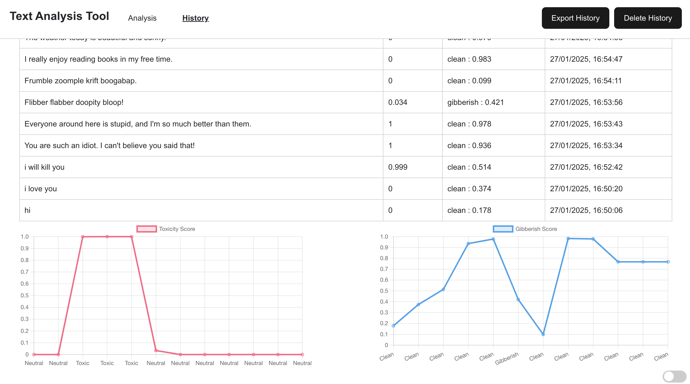

# REST API and Web Application for Text Scoring

## Purpose

The purpose of this task is to develop a REST API and web application capable of receiving a string of text, scoring it using machine learning models, and returning the results. The API must log the received text and corresponding results to a database, while the web interface displays these results. 

---

## Problem Statement

Design and deploy a REST API that:  
- Receives a string of text (e.g., output from a language model).  
- Scores the text using machine learning models and returns the results.  
- Log the received text and results to a database.  

Additionally, create a web UI to display the results. The API and web UI must work seamlessly together, reflecting best practices in design and development.

---

## Key Requirements

1. REST API for text scoring with machine learning models.  
2. Database integration for logging input text and results.  
3. Frontend web application for visualizing results.  

---

## Tech Stack

- **Backend**: Flask (Python).  
- **Database**: SQLite.  
- **Frontend**: React with Vite.  
- **Containerization**: Docker and Docker Compose.  

---

## Application Screenshots





---

## Prerequisites

1. **Docker**: Ensure Docker is installed on your machine.
   - Verify the installation:
    ```bash
    docker --version
    ```
   - If Docker is not installed, download it from the [official Docker website](https://www.docker.com/).

2. **Docker Compose**: Docker Compose is included with Docker Desktop.

---

## Instructions to Run the Application

### 1. Clone the Repository
   Clone the project repository and navigate to the project folder:
   ```bash
   git clone <repository-url>
   cd <repository-folder>
   ```
 
### 2. Create a local copy of this repository and run
   ```bash
   docker compose build
   ``` 
    
This spins up Compose and builds a local development environment according to 
our specifications in [docker-compose.yml](docker-compose.yml).
#### Note: If ```docker compose build``` didn't work the first time, try running it again 

### 3. After the containers have been built (this will take a few minutes), run
   ```bash
   docker compose up
   ```        
This one command boots up a local server for Flask (on port 5000)
and React (on port 5173). Head over to
   ```bash
   http://localhost:5173/ 
   ``` 
to view a basic Text Analysis Tool.You can access the REST API endpoints at http://localhost:5000/api/analyze to analyze text and http://localhost:5000/api/history to view the history of previous analyses. These endpoints are part of the backend services.

### 4. Finally, to gracefully stop running our local servers, you can run
   ```bash
   docker compose down
   ```
in a separate terminal window or press __control + C__.

### Note: I have left the Hugging Face API keys in the code to simplify running the application with just two Docker commands. Otherwise, I would have removed them from the files before uploading to GitHub. 


